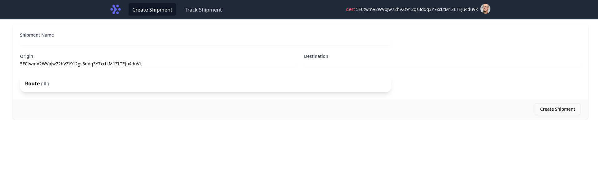
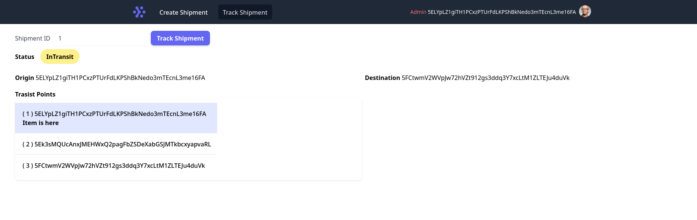

# sub-tracker-frontend
Front end 🖥️ for Shipment tracking system built on top of blockchain powered by **Substrate** . 

**Built using**
- [PolkadotJS](https://polkadot.js.org/docs/)
- [Svelte](https://svelte.dev)

## Pre-requisite
PolkadotJS extention 
- [Chrome](https://chrome.google.com/webstore/detail/polkadot%7Bjs%7D-extension/mopnmbcafieddcagagdcbnhejhlodfdd) 
- [Firefox](https://addons.mozilla.org/en-US/firefox/addon/polkadot-js-extension/)

## App Screen shots

**Create Shipment**

**Track Shipment**

## Installation

`
npm i
`

## Run

`
npm run dev
`